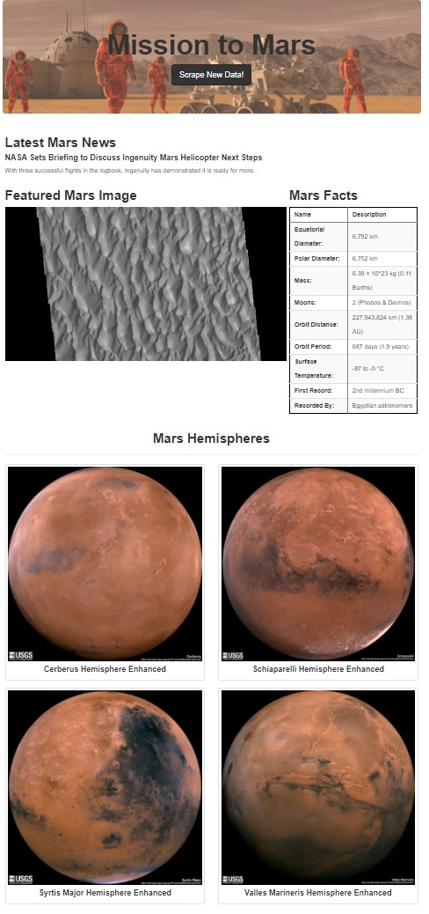

# Mars Data Visualization
Web Scraping project for Monash Data Analytics Boot Camp

The purpose of this project was to build a web application that scrapes various websites for data related to Mars and displays the information in a single HTML page.

# Data

There are four key sources of data used:

* [NASA Mars News](https://mars.nasa.gov/news/) - website used to get the latest news title and paragraph text

* [Featured Space Image](https://data-class-jpl-space.s3.amazonaws.com/JPL_Space/index.html) - website used to get the featured space image

* [Mars Facts](https://space-facts.com/mars/) - website used to get the he table containing facts about the planet

* [USGS Astrogeology](https://astrogeology.usgs.gov/search/results?q=hemisphere+enhanced&k1=target&v1=Mars) - website used to get high resolution images for each of Mar's hemispheres

# Analysis

## Jupyter Notebook

* Scrape the `NASA Mars News` and collect the latest News Title and Paragraph Text

* Visit `Featured Space Image`, use splinter to navigate the site and find the image url for the current Featured Mars Image and assign the url string to a variable

* Visit `Mars Facts` and use Pandas to scrape the table containing facts about the planet

* Convert the data to a HTML table string

* Visit `USGS Astrogeology` and collect high resolution images for each of Mar's hemispheres

* Click each of the links to the hemispheres in order to find the image url to the full resolution image

* Save both the image url string for the full resolution hemisphere image, and the Hemisphere title containing the hemisphere name in a Python dictionary

* Append the dictionary with the image url string and the hemisphere title to a list

## MongoDB and Flask Application

* Use MongoDB with Flask templating to create a new HTML page that displays all of the information that was scraped from the URLs above:

  * Convert Jupyter notebook file into a Python script called `scrape_mars.py` with a function called `scrape` that will execute all of scraping code from above and return one Python dictionary containing all of the scraped data

  * Create a route called `/scrape` that will import `scrape_mars.py` script and call `scrape` function

  * Store the return value in Mongo as a Python dictionary

  * Create a root route `/` that will query Mongo database and pass the mars data into an HTML template to display the data

  * Create a template HTML file called `index.html` that will take the mars data dictionary and display all of the data in the appropriate HTML elements:

  

# Demo

To run the example locally run the `climate_starter.ipynb` file in Jupyter Notebook. 

To visit Mars Data Visualization webpage run `python app.py` in command line and visit `http://localhost:5000/`. NOTE: This application requires open local MongoDB connection and `config.py` file with local `driver_path` for `ChromeDriverManager`.

# Used Tools
 * Jupyter Notebook 
 * Pandas
 * BeautifulSoup
 * splinter  
 * Flask
 * PyMongo
 * MongoDB

 

